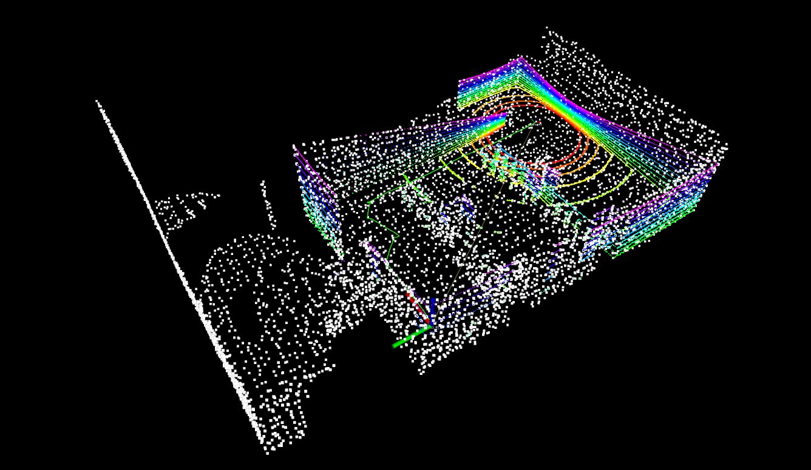

# My_project
This repository is my implementation for ME5413 Autonomous Mobile Robotics Final Project
>Main Authors: Zhang Ceng


## Dependencies
The requirement can be found in https://github.com/NUS-Advanced-Robotics-Centre/ME5413_Final_Project and also an extra ros package
  * `pcl_ros` is used for generate pcl file from rosbag
## Installation
This repo is a ros workspace, containing several rospkgs:
* `ALOAM` is SLAM algorithm package used for 3D mapping
* `costmap_prohibition_layer` provides a quick way to add virtual obstacle in costmap to set prohibited region
* `interactive_tools` are customized tools to interact with gazebo and your robot
* `jackal_description` contains the modified jackal robot model descriptions
* `jackal_navigation` contains a probabilistic localization system for navigation
* `me5413_world` the main pkg containing the gazebo world, and the launch files
* `pcd2pgm` for converting pcd file to pgm map which can be used for navigation
```bash
# Clone this repo
cd
git clone https://github.com/Tomshine123/My_project.git
cd My_project

# Install all dependencies
rosdep install --from-paths src --ignore-src -r -y

# Build
catkin_make
# Source 
source devel/setup.bash
```
To properly load the gazebo world, you will need to have the necessary model files in the `~/.gazebo/models/` directory, which installation instructions can be found in URL above.
## Usage
### 1. Mapping
Following commands will launch the gazebo with the project world and also A-LOAM SLAM for 3D Lidar
```bash
# Launch Gazebo World together with our robot
roslaunch me5413_world world.launch
# In the second terminal, launch A-LOAM SLAM for 3D Lidar
roslaunch aloam_velodyne aloam_velodyne_VLP_16.launch 
# In order to drive the robot around for mapping, launch keyboard control node in the third terminal
rosrun teleop_twist_keyboard teleop_twist_keyboard.py 
```
By above you can visualize pointclouds, and finish mapping by exploring all possible areas

To save the pointcloud in a pcl file, run rosnode in `pcl_ros` package
```
rosrun pcl_ros pointcloud_to_pcd input:=/laser_cloud_surround
```bash
